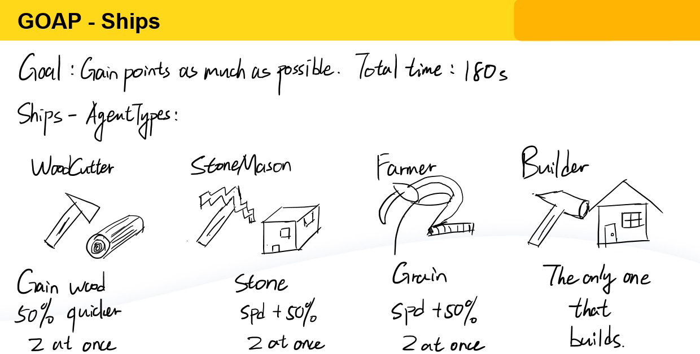
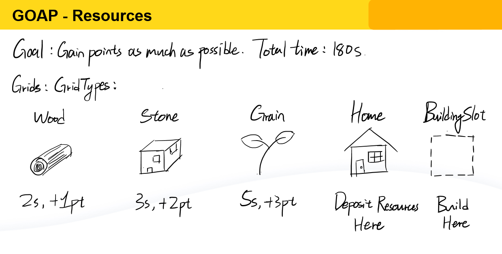

# UE5 Goal Oriented Action Planning

This project involves the interaction of various classes of AI controlled entities with the environment and among themselves using GOAP for action planning. It is set in the following
scenario. On the surface of a bountiful ocean, there exists many useful resources: wood, stone, and grain. A pack of adventurers decide to stay around and use those resources to build
a new settlement.

The adventurers split up into multiple groups based on skills and set sail to the ocean. The **Wood Cutters** are specialized in forestry and they target on
collecting woods. The **Stone Masons** have a keen eyesight for stones and they bring top-quality stones to the settlement. The **Farmers** spent countless days and nights in the
field, and they can even spot crops on the ocean surface to bring food to the settlement. And finally, the **Builders** are utilitarian architects and they are the ones who will build the
settlement from scratch.

In 180 seconds, the adventurers are to gather resources and build facilities to gain points as many as possible. I used GOAP action planning to help each ship decide the best
action to perform in every situation it may encounter. Details of the simulated environment are in the following images.

## Goal Oriented Action Planning (GOAP)

In this project, GOAP is used for each ship to know what to do next. Unlike state machines, with GOAP, each AI controlled entity has the ability to figure out the best action to
perform based on A-star algorithm with designed heuristic. Here, the heuristic I used is the number of different properties between the current state and the target state.

### State
Each state consists of one or more properties. Each property is a key-value pair such as the number of resources in the ship and the number of resources at home. 

### Goal Condition
The goal condition is what the ships want to achieve. In order to achieve the goal condition, the ships search through possible actions to take and decide on a sequence of actions that
achieves the goal in the fastest way, and that's where the A-star algorithm kicks in. See `GOAPPlanner`, `GOAPAction` and its subclasses, and `Ship` for more details on this part.

## Route Planning
After deciding the actions to take, each ship needs to go to its goal location. This is also achieved through A-star algorithm where the heuristic is the Manhatten distance from the
current node to the goal node. Collisions of ships are avoided as many as possible by searching for the next possible location to go.
